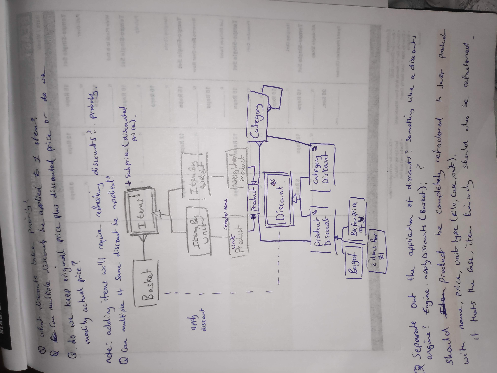
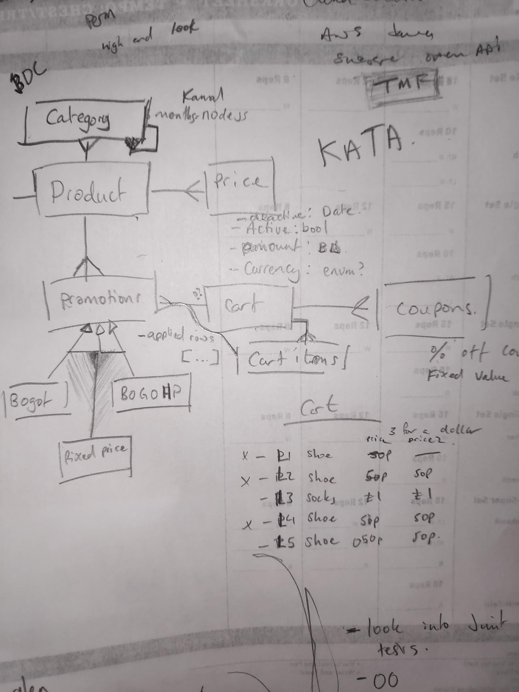

# Notes

## THANK YOU
I really enjoyed this test, its been a while since I've done a test that makes sense

### Notes:

- For tests I usually use Mockito to loosely couple my components but I didn't want to use my time up
playing about with external libs so I just kept that simple for now. In a proper app, I'd expect to use it

- I decided to add `discountedPrice` to the `Item` so that we could keep the original price on the item
for audit purposes. `product` was also added as I needed a way for the discounts to know which item was
applicable for a discount. I didn't want a `Product` to know anything about `Discount` so I made it unidirectional

- The `DiscountApplicator` uses the observer pattern to apply discounted prices to each basket item.
In the future, this could be extended by creating new `Discount` types by extending the `Discount` base
class and adding it to the applicator.

- I've made no attempt to ensure only one discount can be applied to an `Item`. If more `Discount`s are
added, I would add a flag to Basket Items so they can only have one discount applied to them, the applicator
will then need to be updated to filter items that have a discount applied

- Also made no attempt to deal with discount priorities

- It might be a better choice to move the calculation of discounts on the addition of items to the basket
but that will need more thought/fleshing out

- I've added a high level scribble of what I was thinking when reading the task and also the design for the KATA

Task: 

KATA:

